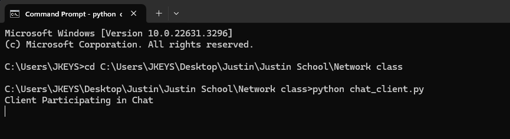

[Back to Portfolio](./)

ChatRoom
===============

-   **Class: CSCI 332** 
-   **Grade:TBD** 
-   **Language(s):Python** 
-   **Source Code Repository:** [Chat-Code](https://github.com/Jkeys17/Chat-Code.git)  
    (Please [email me](mailto:jlkeys@csustudent.net?subject=GitHub%20Access) to request access.)

## Project description

The main part of our project is building a chatroom with Python. This digital area is meant to let people talk to each other in real time, creating a lively place to share thoughts and have conversations. Using Python's powerful tools, we've built a platform that not only puts user-friendliness and accessibility first, but also makes sure that communication is safe and effective. Additionally, this project shows our dedication to using technology to connect people, no matter where they live, and it also shows how well Python can be used to build strong online groups.

## How to compile and run the program

```bash
save the two python files.
cd ./project
python chat_server.py
python chat_client.py
```

## UI Design

This chat application allows users to engage in real-time text communication over a network. It consists of two main components: a server that orchestrates the message flow (see Fig 1) and clients that connect to this server to participate in the chat (see Fig 2). Users can send and receive messages, connect to or disconnect from the chatroom, and see messages from other participants in real-time (see Fig 3).

  
Fig 1. The Server Screen

  
Fig 2. Example output after input by client.

  
Fig 3.  Example output after input by client.

[Back to Portfolio](./)
