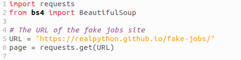
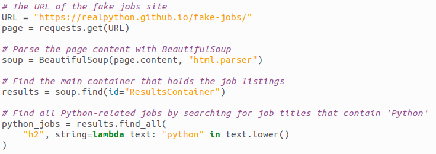
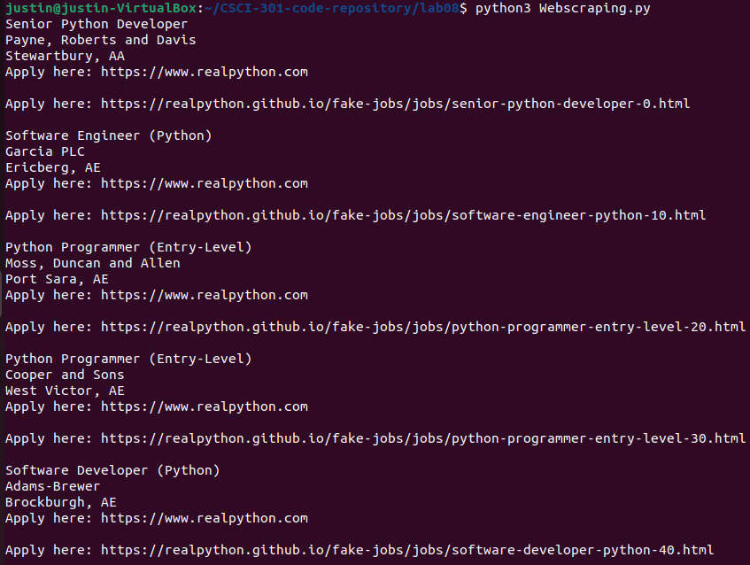

[Back to Portfolio](./)

Webscraping
===============

-   **Class: CSCI 301** 
-   **Grade:100** 
-   **Language(s):Python** 
-   **Source Code Repository:** [Webscraping](https://github.com/Jkeys17/CSCI-301-code-repository.git)
    (Please [email me](mailto:jlkeys@csustudent.net?subject=GitHub%20Access) to request access.)

## Project description

Real Python guides you through building a web scraper using Python's Beautiful Soup library. It starts with understanding web scraping basics, reasons for scraping, and its challenges. You'll learn how to inspect your data source, scrape HTML content from a page, and parse HTML code with Beautiful Soup. The project focuses on fetching job offers from a fake Python job site, offering hands-on experience with web scraping techniques and tools necessary for scraping static websites.

## How to compile and run the program

```bash
save the Webscraping.py to your local machine.
cd ./project
python Webscraping.py
```

## UI Design

The program allows users to input URLs of static websites from which they wish to scrape data (see Fig 1). Users can specify the type of data to collect, such as job listings from a job board (see Fig 2). The program then fetches the HTML content, parses and extracts the specified information using Beautiful Soup, and displays or saves the extracted data for the user's review or further processing (see Fig 3). This user interaction is integral to guiding the program on what data to collect and from where. 

  
Fig 1. URL of Website to scrape.

  
Fig 2. List of Jobs that match criteria.

  
Fig 3.  List of Jobs that match criteria.

## 3. Additional Considerations

Sed ut perspiciatis unde omnis iste natus error sit voluptatem accusantium doloremque laudantium, totam rem aperiam, eaque ipsa quae ab illo inventore veritatis et quasi architecto beatae vitae dicta sunt explicabo. 

For more details see [GitHub Flavored Markdown](https://guides.github.com/features/mastering-markdown/).

[Back to Portfolio](./)
